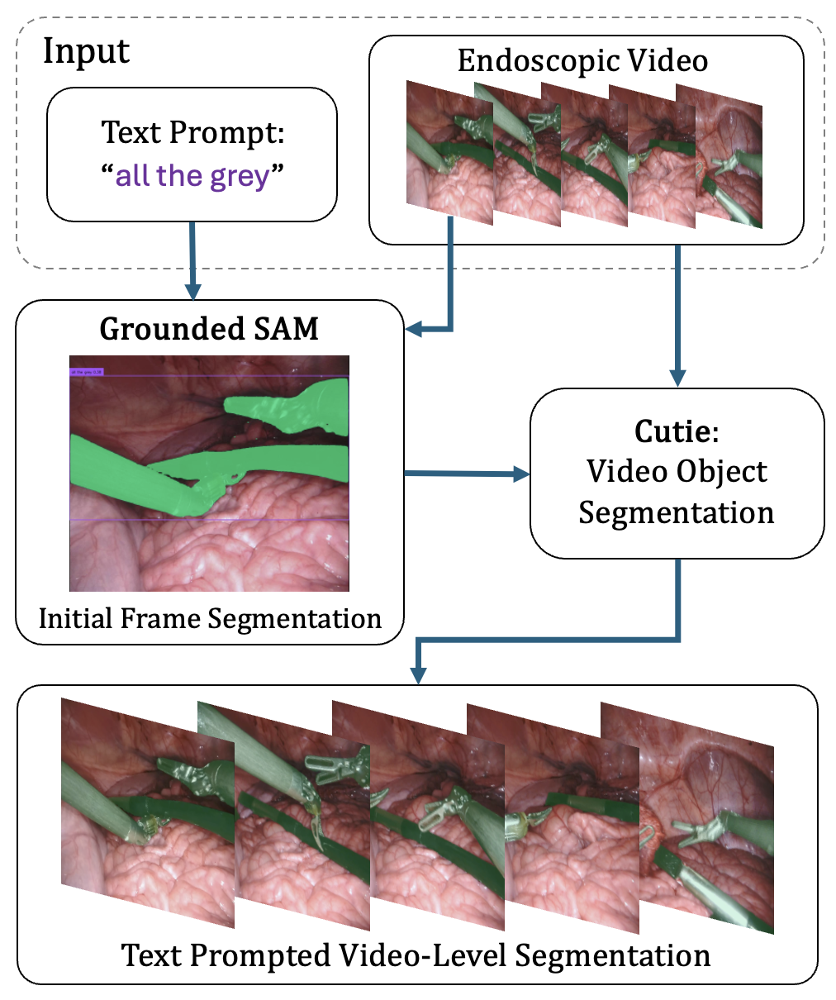

<h2 align="center"> GSAM+Cutie: Text-Promptable Tool Mask Annotation for Endoscopic Video </h2>

<h5 align="center"><em>Roger David Soberanis-Mukul, Jiahuan Cheng, Jan Emily Mangulabnan, S. Swaroop Vedula, Masaru Ishii, Gregory D. Hager, Russ Taylor, Mathias Unberath</em></h5>


## Abstract
Machine learning approaches for multi-view geometric scene understanding in endoscopic surgery often assume temporal consistency across the frames to limit challenges that algorithms contend with. However, in monocular scenarios where multiple views are acquired sequentially rather than simultaneously, the static scene assumption is too strong because surgical tools move during the procedure. To enable multi-view models despite tool motion, masking these temporally inconsistent tool regions is a feasible solution. However, manual tool-masking requires a prohibitive effort, given that endoscopic video can contain thousands of frames. This underscores the need for (semi-)automated techniques to 1) automatically mask the tools and/or 2) semi-automatically annotate large datasets such that algorithms for 1) may be developed. To facilitate semi-automated annotation, any solution must be both generalizable, such that it can be used out-of-the-box on diverse datasets, and easy to use. Recent methods for surgical tool annotation require either fine-tuning on domain-specific data or excessive user interaction, limiting their application to new data. Our work introduces GSAM+Cutie, a surgical tool annotation process relying on a combination of two recent foundation models for text-based image segmentation and video object segmentation. We show that a combination of Grounded-SAM and Cutie models provides good generalization for robust text-prompt-based video-level binary segmentation on endoscopic video, streamlining the mask annotation task. Through quantitative evaluation on two datasets, including a proprietary in-house dataset and EndoVis, we show that GSAM+Cutie outperforms similar ensembles, like SAM-PT, for video object segmentation. We also discuss the limitations and future research directions that GSAM+Cutie can motivate.



## Demo Video
<h4>Demo 1: Endovis2017_Instrument_Dataset_3</h4>
<p align="center">

</p>
<h4>Demo 2: In-house Sinus Endoscopic Video</h4>
<p align="center">

</p>


## Installation
Tested on Ubuntu 20.04.6

For our method, `python=3.9`, `torch=1.11.0`, `torchvision=0.12.0` are used

1. Clone the repository:
```bash
git clone git@github.com:arcadelab/cutie_plus_gsam.git --recurse-submodules
```

2. Install with pip:
```bash
cd segment-anything; pip install -e .
cd GroundingDINO; pip install -e .
cd Cutie; pip install -e .
```

### Download Weights
1. Download checkpoints for GroundingDINO
```bash
cd GroundingDINO
mkdir weights
cd weights
wget -q https://github.com/IDEA-Research/GroundingDINO/releases/download/v0.1.0-alpha/groundingdino_swint_ogc.pth
wget -q https://github.com/IDEA-Research/GroundingDINO/releases/tag/v0.1.0-alpha2
cd ..
```

2. Download checkpoints for SAM under the below directory
```bash
cd segment-anything
mkdir checkpoints
```

3. Download checkpoints for Cutie manually, or they will be automatically downloaded when running `run_cutie_scripting_demo.py`
```bash
python scripts/download_models.py
```

## QuickStart Guide

Follow these simple steps to get started with the project:
#### 1. Modify Configuration
Begin by configuring the settings in the `config.yaml` file to suit your requirements. This file contains various parameters, such as checkpoint paths, text prompt, dataset, etc.

#### 2. Make annotations on the annot_image
`python annotate_binary.py`

#### 3. Run cutie to propogate initial mask
`python run_cutie_scripting_demo.py`

#### 4. Generate masked frames and videos with masked frame
`python generate_video.py`

Results will be saved under the `data` folder

## Acknowledgement
Thanks Grounding DINO, Segment-Anything, and Cutie for their awesome work!
- Grounding DINO:  https://github.com/IDEA-Research/GroundingDINO
- Segment-Anything:   https://github.com/facebookresearch/segment-anything
- Cutie:  https://github.com/hkchengrex/Cutie


